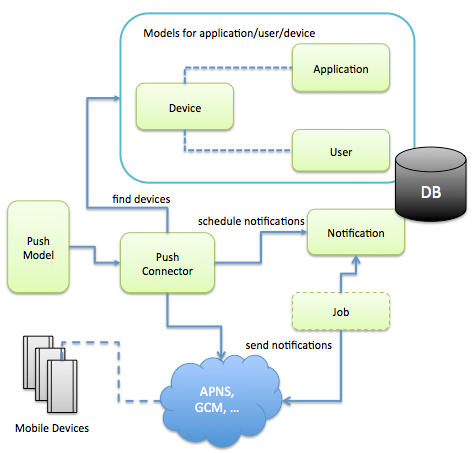

# LoopBack Push Notification

LoopBack Push Notification is a set of server side models to enable mobile push notification services.

## Architecture

## Key Components

* DeviceRegistration model and APIs to manage devices with applications and users
* Application model to provide push settings for device types such as ios and android
* Notification model to capture notification messages and persist scheduled notifications
* Optional Job to take scheduled notification requests
* Push connector that interact with device registration records and push providers such as APNS, GCM, and MPNS.
* Push model to provide high level APIs for device-independent push notifications

## Models and APIs for push notifications

### Sign up an application with push settings

To support push notifications, the mobile application needs to be registered with LoopBack. The `Application` model has
APIs for the sign-up.

    var fs = require('fs');
    var certData = fs.readFileSync(path.join(__dirname, "credentials/apns_cert_dev.pem"), 'UTF-8');
    var keyData = fs.readFileSync(path.join(__dirname, "credentials/apns_key_dev.pem"), 'UTF-8');

    // Sign up an application
    Application.register('test-user', 'TestApp',
        {
            description: 'My test mobile application',
            pushSettings: {
                apns: {
                    pushOptions: {
                        gateway: "gateway.sandbox.push.apple.com",
                        certData: certData,
                        keyData: keyData
                    },
                    feedbackOptions: {
                        gateway: "feedback.sandbox.push.apple.com",
                        certData: certData,
                        keyData: keyData,
                        batchFeedback: true,
                        interval: 300
                    }
                }
            }
        }, function (err, result) {
            if (err) {
                throw err;
            }
            ...
        });

### Register a new device

The mobile device also needs to register itself with the backend using DeviceRegistration model and APIs. To
register a device, we can call the `DeviceRegistration.create` API as follows:

    DeviceRegistration.create({
        appId: 'MyLoopBackApp',
        userId: 'raymond',
        deviceToken: '75624450 3c9f95b4 9d7ff821 20dc193c a1e3a7cb 56f60c2e f2a19241 e8f33305',
        deviceType: 'apns',
        created: new Date(),
        modified: new Date(),
        status: 'Active'
    }, function (err, result) {
        console.log('Registration record is created: ', result);
    });

The DeviceRegistration model is exposed as CRUD REST APIs.

        POST http://localhost:3000/deviceRegistrations
        {
            "appId": "MyLoopBackApp",
            "userId": "raymond",
            "deviceToken": "75624450 3c9f95b4 9d7ff821 20dc193c a1e3a7cb 56f60c2e f2a19241 e8f33305",
            "deviceType": "apns"
        }

### Configure LoopBack Push Notification

    var ds = require('./data-sources/db');
    var PushModel = require('loopback-push-notification')(app, {dataSource: ds});

### Send notifications

#### APNS

    var note = new apn.Notification();

    note.expiry = Math.floor(Date.now() / 1000) + 3600; // Expires 1 hour from now.
    note.badge = badge++;
    note.sound = "ping.aiff";
    note.alert = "\uD83D\uDCE7 \u2709 " + 'Hello';
    note.payload = {'messageFrom': 'Ray'};

    PushModel.pushNotificationByRegistrationId(req.params.id, note);

#### GCM

## Samples

We embed a folk of [apnagent-ios](https://github.com/logicalparadox/apnagent-ios) under example/apnagent-ios as the
iOS sample app to test push notifications.

You can find the installable app @ https://www.testflightapp.com/dashboard/applications/706217/builds/ too.

## References

- https://developer.apple.com/library/ios/documentation/NetworkingInternet/Conceptual/RemoteNotificationsPG/Chapters/ApplePushService.html
- http://developer.android.com/google/gcm/index.html
- http://msdn.microsoft.com/en-us/library/windowsphone/develop/hh202945(v=vs.105).aspx
- https://github.com/argon/node-apn
- https://github.com/rs/pushd
- https://github.com/logicalparadox/apnagent-ios
- https://blog.engineyard.com/2013/developing-ios-push-notifications-nodejs

